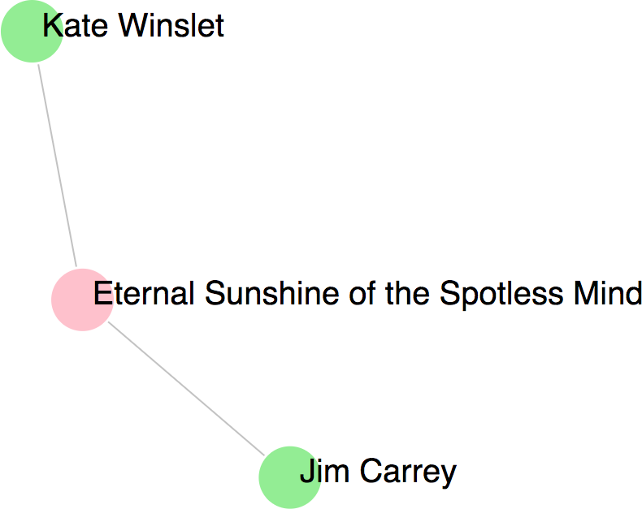

# Six Degrees of Kevin Bacon

This was created during my time as a student at Code Chrysalis.

## Goal

### MVP

1.  The user inputs two actors' names.
1.  The backend calculates the connections between the two actors and sends a response.
1.  The "connection" is displayed as a graph on a white page.

## Data

### Data model

The data is represented in a graph. There are two kinds of nodes:

* person (actors, directors, etc.)
* work (movie, tv show)

An edge between nodes implies that the _person_ appeared in the _movie_.



### Data Source

Data comes from [The Movie Database API](https://developers.themoviedb.org/3). We use three main queries:

* [GET /search/person](https://developers.themoviedb.org/3/search/search-people) - Get a person_id from the String that is entered on the web form.
* [GET /person/{person_id}/movie_credits](https://developers.themoviedb.org/3/people/get-person-movie-credits) - Get the movies that a person was in.
* [GET /search/movie](https://developers.themoviedb.org/3/search/search-movies) - Get a movie_id from the String that is entered on the web form.
* [GET /movie/{movie_id}/credits](https://developers.themoviedb.org/3/movies/get-movie-credits) - Get the people that were in a movie.

## How to use it

After cloning the repository, you need to install the dependencies using `yarn` or `npm`.

```bash
yarn install
```

In order to interface with The Movie Database API, you will need an [API key](https://developers.themoviedb.org/3/getting-started/introduction). After you have an API key, you need to put the key in an **untracked .env file** in your machine. The `.gitignore` for this project already ignores `.env` files, so you'll need to manually create one. It should look like this:

```
# .env
# The Movie DB API keys
THE_MOVIE_DB_API_KEY = [your key here]
THE_MOVIE_DB_READ_ACCESS_TOKEN = [your key here]
```

There is a simple script for running the app.

```
yarn start
```

Once the server is running on your machine, you should be able to navigate to `localhost:1337` and see the app in action. Enter the actor names, press submit and enjoy the magic. Have fun!

## Contributing

If you are interested in contributing to this project, feel free to add an issue or submit a pull request. I look forward to working with you.

Thank you for your interest in this project.
